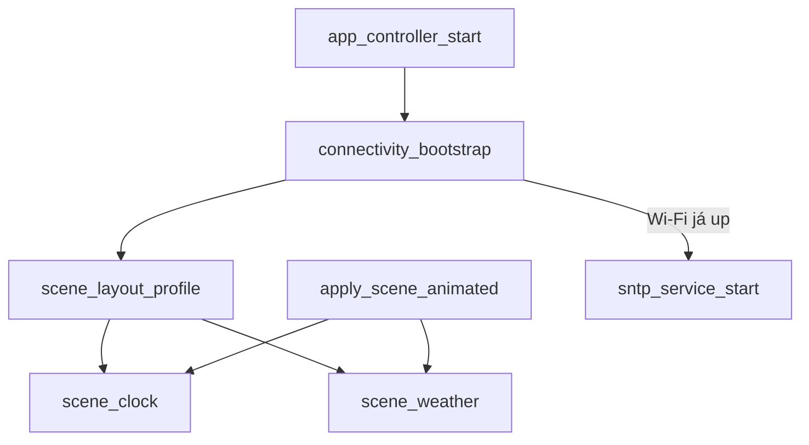

# Implementation Plan: Dashboard LVGL Dinâmico

**Branch**: `005-lvgl-dynamic-dashboard` | **Date**: 2026-06-19 | **Spec**: [spec.md](./spec.md)

## Summary

Corrigir regressão do relógio (evento Wi-Fi perdido + refresh pós-SNTP) e evoluir telas horário/clima com layout responsivo (128×64 / 256×128), transições LVGL (fade ≤500 ms) e estados visuais distintos. Novo módulo `scene_layout` centraliza tipografia e margens; `app_controller` orquestra transições e bootstrap de conectividade idempotente.

## Technical Context

**Language/Version**: C, ESP-IDF v6.1, target esp32s3  
**Primary Dependencies**: LVGL 9.x, componentes existentes (`display_lvgl`, `connectivity`, `storage`, `app`)  
**Storage**: NVS inalterado (tz, dwell, weather cache)  
**Testing**: `idf.py -B ~/esp32_led_painel-build build`; validação hardware single + 2×2  
**Target Platform**: MatrixPortal S3 + HUB75 (128×64 ou 256×128 via `004`)  
**Performance Goals**: Transição ≤500 ms; tick relógio 1 s; sem bloquear task LVGL  
**Constraints**: Sem alteração GPIO/partição/NVS schema; fontes Montserrat; heap PSRAM  
**Scale/Scope**: 2 cenas (clock, weather), 2 breakpoints de layout, 1 animação de troca

## Constitution Check

*GATE: Must pass before Phase 0 research. Re-check after Phase 1 design.*

| Principle | Pre-design | Post-design |
|-----------|------------|-------------|
| I Hardware | PASS — sem mudança pinagem/FM6126A | PASS |
| I UI contract | **AMEND** — fontes escalonadas 256×128; animações leves | Documentado em contracts/ui-layout.md |
| II Spec first | PASS | PASS |
| III Diagnostics | PASS — logs sync, transição, refresh hora | PASS |
| IV Clean Architecture | PASS — `scene_layout` em `app/`; connectivity bootstrap fix isolado | PASS |
| V Validation | PASS — build gate + hardware | PASS |

**Sem alteração**: pinagem, NVS keys, MQTT, partições, Open-Meteo contract.

## Project Structure

### Documentation (this feature)

```text
specs/005-lvgl-dynamic-dashboard/
├── plan.md
├── research.md
├── data-model.md
├── quickstart.md
├── contracts/
│   ├── ui-layout.md
│   ├── scene-transitions.md
│   └── diagnostics.md
└── tasks.md          # /speckit-tasks
```

### Source Code

```text
components/app/
├── scene_layout.c / include/scene_layout.h   # NEW — breakpoints, fonts, margins
├── scene_clock.c                             # layout + estados visuais
├── scene_weather.c                           # layout + stale indicator
├── app_controller.c                          # bootstrap Wi-Fi/SNTP, transições
components/connectivity/wifi_manager.c        # log hora pós-sync, export sync helper
components/storage/painel_storage.c           # painel_tz_apply (já existe)
sdkconfig.defaults.esp32s3                    # Montserrat 48 para 2×2 (opcional)
```

**Structure Decision**: layout e transição ficam em `components/app/`; fix de conectividade mínimo em `wifi_manager` + bootstrap em `app_controller`.

## Design Overview



### Phase A — Correção do relógio (P1)

1. **`connectivity_bootstrap()`** em `app_controller_start` após registrar callback:
   - Se `wifi_manager_is_connected()`: disparar mesma lógica que `APP_Q_WIFI_UP` (SNTP + fetch weather + `scene_clock_set_wifi(true)`).
   - Se `sntp_service_is_synced()`: `scene_clock_set_sync(CLOCK_SYNC_SYNCED)` imediatamente.
2. **`sntp_sync_cb`**: log hora local mascarado (`HH:MM` apenas); garantir `painel_tz_apply` + `tzset()` antes de notificar UI.
3. **`scene_clock`**: em `CLOCK_SYNC_SYNCED`, validar `tm_year > 2020` antes de exibir; se inválido, manter "Sincronizando…" (não campos vazios).
4. **`scene_clock_set_sync(SYNCED)`**: forçar `refresh()` síncrono via `display_lvgl_async` (já existe) + log `app_ctrl` se hora vazia com sync OK.

**Causa raiz identificada**: `wifi_manager_start()` pode emitir `IP_EVENT_STA_GOT_IP` **antes** de `wifi_manager_set_callback()` em `app_controller_start`, perdendo `APP_EVT_WIFI_UP` → SNTP nunca inicia → tela permanece "Sem hora".

### Phase B — Layout responsivo (P1)

Novo `scene_layout_profile_t`:

| Breakpoint | Condição | Hora/temp font | Rótulo font | Margem |
|------------|----------|----------------|-------------|--------|
| `compact` | hor ≤128 | Montserrat 24 | Montserrat 12 | 2 px |
| `large` | hor >128 | Montserrat 48* | Montserrat 24* | 4 px |

\*Habilitar `CONFIG_LV_FONT_MONTSERRAT_48` e `CONFIG_LV_FONT_MONTSERRAT_24` já parcialmente ativo; 48 novo em `sdkconfig.defaults.esp32s3`.

- `scene_layout_apply(root, profile)` define size, pad, align offsets.
- Cenas chamam `scene_layout_get()` uma vez em `create()` e reposicionam em `scene_*_show()` se resolução mudar (build-time only).

### Phase C — Transições e estados (P2)

- Substituir `apply_scene()` por `apply_scene_animated()`:
  - Fade out cena atual (250 ms) → swap visibility → fade in (250 ms).
  - LVGL: `lv_obj_fade_out` / `lv_obj_fade_in` ou `lv_anim` em `opa`.
- Estados visuais:
  - Clock: "Sincronizando…" (pending), "Sem Wi-Fi", "Sem hora" (error), hora+data (synced).
  - Weather: prefixo `~` + cor cinza para stale; ícone/texto "!" para erro.
- Log `app_ctrl`: `scene transition clock→weather`.

## Complexity Tracking

| Amendment | Why | Alternative rejected |
|-----------|-----|---------------------|
| Montserrat 48 para 256×128 | Legibilidade a 1 m em canvas 4× | `transform_scale` 2× blur em LED matrix |
| connectivity_bootstrap | Race Wi-Fi vs callback | Delay artificial em main — frágil |

## Post-Design Constitution Re-check

- UI contract ampliado: breakpoints `compact`/`large`; transição ≤500 ms; diagnósticos de cena.
- Hardware/topologia/NVS inalterados.

## Next Steps

1. `/speckit-tasks` → `tasks.md`
2. `/speckit-implement` — ordem: bootstrap/SNTP → clock fix → scene_layout → transitions → build
